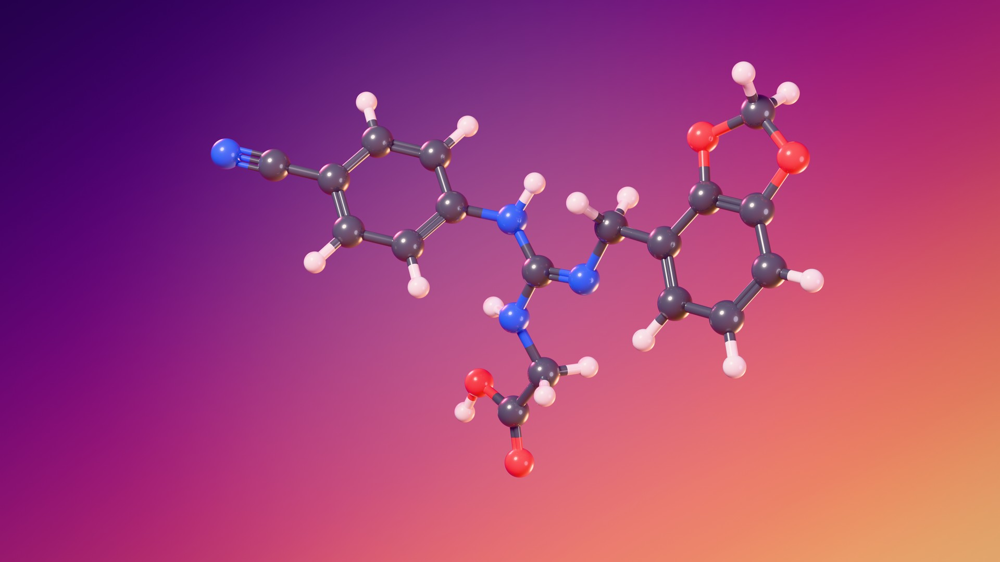

# Lugduname — vue 3D sous Blender



Modèle boules-bâtons du **lugduname** rendu avec Blender (moteur Cycles) sur un
grand fond dégradé diagonal indigo → violet → framboise → corail → pêche.

| | |
|---|---|
| Nom | acide N′-(4-cyanophényl)-N″-(2,3-méthylènedioxybenzyl)guanidinoacétique |
| Formule | C₁₈H₁₆N₄O₄ — 352,35 g/mol |
| SMILES | `N#CC1=CC=C(C=C1)NC(=NCC=2C=CC=C3OCOC32)NCC(=O)O` |

Le lugduname, mis au point à l'Université de Lyon (*Lugdunum*) en 1996, est l'un
des édulcorants les plus puissants connus : de 220 000 à 300 000 fois le pouvoir
sucrant du saccharose selon les estimations.

Code couleur : carbone gris anthracite, hydrogène blanc, azote bleu, oxygène
rouge. Les liaisons doubles sont dessinées avec deux bâtons, la triple liaison
du nitrile (C≡N) avec trois ; chaque bâton prend la couleur de ses deux atomes.

## Fichiers

| Fichier | Rôle |
|---|---|
| `lugduname.blend` | la scène Blender, prête à rendre |
| `renders/lugduname_4k.png` | le rendu final, 3840 × 2160 |
| `renders/lugduname_apercu.jpg` | version allégée (1920 × 1080) |
| `build_scene.py` | construit toute la scène à partir du SDF : atomes, liaisons, matériaux, fond, lumières, caméra, tourniquet |
| `lugduname.sdf` | coordonnées 3D (Å), 42 atomes et 44 liaisons |
| `generate_conformer.py` | calcule ces coordonnées avec RDKit |

## Ouvrir et rendre

Ouvrir `lugduname.blend` avec **Blender 4.2 ou plus récent** (vérifié avec 4.2
et 5.1, rendu identique) : la vue caméra s'affiche en aperçu matériaux avec le
fond dégradé. Le fichier ne dépend d'aucune texture ni fichier externe.

- **F12** : rend l'image fixe (réglages du rendu final : 3840 × 2160, 256 échantillons).
- **Ctrl+F12** : rend le tourniquet, un tour complet de la molécule en 240 images
  (10 s à 24 images/s), écrit dans `renders/`. L'image 1 est la vue principale.
  En 4K, c'est long : baisser d'abord la résolution (*Output > Format > %*) et
  le nombre d'échantillons (*Render > Sampling*).

Le script et le SDF sont aussi embarqués dans le `.blend` (onglet *Scripting*).

## Regénérer la scène

```bash
# avec Blender installé
blender -b -P build_scene.py -- --save lugduname.blend --render renders/lugduname_4k.png

# ou avec le module Python de Blender
pip install bpy==5.1.2   # Python 3.13 (ou bpy==4.2.0 avec Python 3.11)
python build_scene.py --save lugduname.blend --render renders/lugduname_4k.png

# aperçu rapide : 960 × 540, 64 échantillons
python build_scene.py --render apercu.png --percentage 25 --samples 64

# tourniquet en vidéo
python build_scene.py --animation renders/tourniquet.mp4 --resolution 1280 720 --samples 64
```

`--sdf autre_molecule.sdf` affiche n'importe quelle autre molécule (fichier SDF/MOL V2000).

## Personnaliser

Tout se règle en tête de `build_scene.py` :

- `GRADIENT` : les couleurs et positions du dégradé ; `GLOW_STRENGTH` et `VIGNETTE`
  pour le halo derrière la molécule et l'assombrissement des coins ;
- `ELEMENTS` : couleur et rayon de chaque élément ;
- `VIEW_ROTATION` : orientation de la molécule face à la caméra ;
- `LIGHTS` : position, taille, puissance et couleur des quatre lumières.

Dans Blender, on peut aussi tourner l'objet vide `Lugduname`, qui porte tous les
atomes, ou modifier le nœud *Color Ramp* du monde `Grand dégradé`.

## D'où vient la géométrie

Aucune structure cristallographique n'est utilisée : la conformation est
calculée. `generate_conformer.py` part du SMILES, génère 300 conformères
(ETKDGv3, RDKit) et les optimise avec le champ de force MMFF94. Parmi ceux à
moins de 1 kcal/mol du minimum trouvé, il retient celui qui remplit le mieux un
cadre 16:9 vu de face, pour que les trois bras de la molécule restent lisibles.
Le conformère retenu est à 0,5 kcal/mol du minimum.

```bash
pip install rdkit
python generate_conformer.py   # réécrit lugduname.sdf
```
